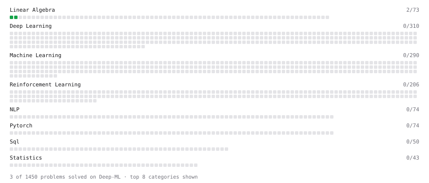

# Deep-ML

My machine learning practice from [Deep-ML](https://www.deep-ml.com). Every solution here was written by hand.

**9** solved · 5 problems · 0 labs · 4 math

[**Browse the interactive portfolio**](https://suman123rock.github.io/deep-ml/) to replay this filling in over time.

## Problems

| | Difficulty | Solved | |
| --- | --- | --- | --- |
| [Derivative of a Polynomial](https://www.deep-ml.com/problems/116) | easy | 2026-07-20 | [solution](problems/0116-derivative-of-a-polynomial) |
| [Dot Product Calculator](https://www.deep-ml.com/problems/83) | easy | 2026-09-15 | [solution](problems/0083-dot-product-calculator) |
| [Matrix-Vector Dot Product](https://www.deep-ml.com/problems/1) | easy | 2026-07-19 | [solution](problems/0001-matrix-vector-dot-product) |
| [Transpose of a Matrix](https://www.deep-ml.com/problems/2) | easy | 2026-07-26 | [solution](problems/0002-transpose-of-a-matrix) |
| [Vector Element-wise Sum](https://www.deep-ml.com/problems/121) | easy | 2026-09-15 | [solution](problems/0121-vector-element-wise-sum) |

## Math

| | Difficulty | Solved | |
| --- | --- | --- | --- |
| [Matrix Basics](https://www.deep-ml.com/math-problems/9) | easy | 2026-09-14 | [solution](math/0009-matrix-basics) |
| [Vector Operations](https://www.deep-ml.com/math-problems/7) | easy | 2026-09-14 | [solution](math/0007-vector-operations) |
| [Matrix Multiplication](https://www.deep-ml.com/math-problems/10) | medium | 2026-09-14 | [solution](math/0010-matrix-multiplication) |
| [Vector Norms and Linear Independence](https://www.deep-ml.com/math-problems/8) | medium | 2026-09-14 | [solution](math/0008-vector-norms-and-linear-independence) |

---

_This file is regenerated by Deep-ML on every push._
